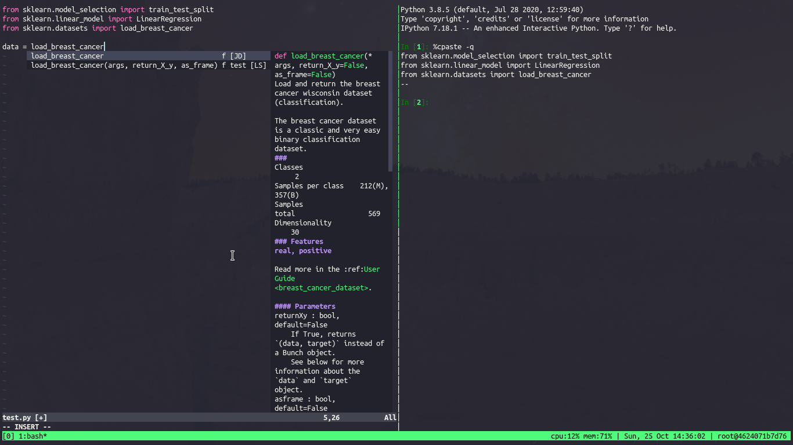

# ubuntu-tmux-vim


# Clone

```bash
git clone https://github.com/kguidonimartins/ubuntu-tmux-vim.git
```

# Build

```bash
make build
```

# Run

```bash
docker run -it --rm --user root -v $(pwd):/work -w /work kguidonimartins/ubuntu-tmux-vim
```

<!--
# Run

```bash
make run
```
-->

## Install basic languages

Inside the container, install basic languages.

```bash
cd $HOME && install-libs --all
```

After basic installation, you have a fully IDE inside this container.



<!--
## Commit changes

```bash
# get container id
docker ps
# commit
docker commit <container_id> <new_image_name>
```

# Run the new image

```bash
docker run -it --rm -v $(pwd):/work -w /home/vimuser <new_image_name>
# assim funciona também não tenho acesso às coisas que eu quero (plugins e tal)
docker run -it --rm --user $(id -u) -v $(pwd):/work -w /work kguidonimartins/ubuntu-tmux-vim
# assim também vai
docker run -it --rm --user root -v $(pwd):/work -w /work kguidonimartins/ubuntu-tmux-vim
```

-->


